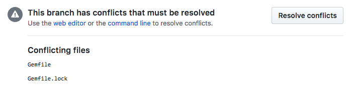

# Git e Pull Requests

## Git

* Sempre use o email da empresa para commits nos projetos;

### Branches

* Crie branches para todos os seus trabalhos;
* Em alguns projetos, o commit direto na master é bloqueado, então recomendamos nunca fazer isso;
* Use um [gitignore global para ignorar](https://help.github.com/articles/ignoring-files) arquivos que são específicos ao seu ambiente (configurações de editor, arquivos de sistema indesejados - por exemplo `.DS_Store` no Mac, `*.swp` do vim, etc.);
* Nomeie seus branches usando `-` para separar as palavras;
* Prefixe seus branches de acordo com o tipo de trabalho: `feature/nome-da-feature`, `bug/nome-do-bug-fix` e assim por diante;

```shell
  git checkout -b feature/crud-de-user
```

* Quando precisar atualizar a sua branch com a master, é preferível primeiro atualizar a master com `rebase`, e depois fazer merge com a sua branch;

```
  $ git checkout master
  $ git pull --rebase
  $ git checkout feature/minha-feature
  $ git merge master
```

* Quando mergear sua branch na master, em geral você vai querer usar a interface de Pull Request do Github. Mais sobre isso abaixo;
* Apague as suas branches localmente e remotamente depois do merge;

### Commits

A mensagem de commit é uma das formas de documentação mais importantes em uma base de código. Caso um bug seja introduzido, uma boa mensagem de commit facilita a identificação de onde/quando isso aconteceu, e principalmente o porquê daquela alteração ter sido feita.

* Escreva suas mensagens de commit em Português;
* Boas mensagens de commit incluem um resumo e outras informações se necessário; O resumo deve dar um panorama geral do commit e o texto abaixo deve incluir mais explicações (principalmente 'Por que esse commit foi necessário?'); não escreva simplesmente o que foi feito, isso dá para saber pelo diff.
* Escreva o resumo na forma imperativa, ou seja, como se completasse a seguinte frase: “Se aplicado, esse commit vai `seu resumo aqui`”. Por exemplo: "*Se aplicado, esse commit vai* `Atualizar o README com informações sobre testes`"
* A primeira linha (o resumo) deve ter no máximo 50 caracteres
* As linhas seguintes devem ter no máximo 72 caracteres
* Leia mais sobre isso [aqui](http://tbaggery.com/2008/04/19/a-note-about-git-commit-messages.html) e [aqui](https://www.lucascaton.com.br/2017/10/16/como-escrever-mensagens-de-commits-no-git/).
* Sugestão: inclua um `.gitmessage` na sua home e configure o seu `.gitconfig` para usá-lo; a primeira linha é o resumo e o resto é o corpo do commit;

`.gitconfig`
```
[commit]
  template = ~/.gitmessage
```

`.gitmessage`
```


WHY:

*

HOW:

*

# 50-character subject line
#
# 72-character wrapped longer description.
```

## Pull Requests

Os [Pull Requests](https://help.github.com/articles/using-pull-requests)  do GitHub são uma ótima forma de introduzir novas alterações em um repositório através de revisões assíncronas e discussões sobre as mudanças que você quer fazer - uma nova feature, uma correção de digitação ou um bug complexo em produção que está assombrando seu código.

Revisões assíncronas permitem compartilhar conhecimento técnico: formas mais simples de implementar o mesmo comportamente, problemas conhecidos ao usar certa biblioteca, pedir ajuda em um determinado assunto que você sabe que alguém sabe mais, ou mesmo compartilhar uma decisão de design.

Além disso, quando for feita a revisão, dúvidas vão surgir, o que faz disso a oportunidade perfeita para discutir o comportamento adequado que a sua branch vai introduzir, sobre regras de negócio envolvidas e possíveis caminhos que a sua aplicação pode seguir.

Acima de tudo, os Pull Requests são uma maneira de fazer os desenvolvedores se sentirem conectados e conscientes do que está acontecendo em diferentes projetos.

As seções a seguir explicam com criar, manter e mergear Pull Requests.

* [Começando com branches](#comecando-com-branches)
* [Abrindo um Pull Request](#abrindo-um-pull-request)
* [GitHub Flavored Markdown](#github-flavored-markdown)
* [Screenshots e GIFs](#screenshots-and-gifs)
* [Revisando Pull Requests](#revisando-pull-requests)
* [Seu Pull Request Revisado](#seu-pull-request-revisado)
* [Mergeando Pull Requests](#mergeando-pull-requests)

### Começando com branches

Para começar um Pull Request você vai precisar de um branch para trabalhar nas mudanças que você vai querer introduzir na branch base. A branch base, também chamada de 'mainline' do seu repositório, é a versão atualizada/estável/deployable do seu projeto ou aplicação, que na maioria dos casos é a branch `master` do repositório (exceções devem sempre ser documentadas e justificadas). Você também pode enviar Pull Requests para outras branches no seu repositório, por exemplo quando você está contribuindo em um branch existente de uma feature maior ou uma mudança grande no seu codebase (por exemplo, uma migração de versão do Rails, ou uma nova versão do site). Nesses casos, o branch alvo vai fazer o papel da branch base no lugar da `master`.

Nomeie a sua branch de acordo com o assunto da sua mudança (ver acima em [Git](#git))

### Abrindo um Pull Request

Uma vez que tiver seu branch com alguns commits nele você pode ir para a interface do Github e criar um novo Pull Request no repositório em que estiver trabalhando. Para um guia visual, veja a [página de ajuda do GitHub](https://help.github.com/articles/creating-a-pull-request) sobre como abrir um Pull Request.

Uma parte importante do seu Pull Request é o título e a descrição que você vai escrever. Se sua branch tem um único commit, aquela mensagem do commit será usada para compor o título e a descrição do Pull Request, ou o Github vai sugerir uma versão 'humanizada' do nome da sua branch para o título (como 'Feature crud de user'), o que não ajuda muito. Na maioria dos casos você deve escrever você mesmo para mostrar o que está fazendo e o porquê. Você pode explicar a origem do bug que você está arrumando, ou detalhes da nova feature que você quer introduzir com seu Pull Request. Uma boa prática é colocar o link da história ou o link do chamado e copiar a descrição deles. Ah, escreva tudo em Português.

### GitHub Flavored Markdown

As descrições de Pull Requests suportam o [GitHub Flavored Markdown](https://help.github.com/articles/github-flavored-markdown), então tem uma porção de coisas que podem ser feitas para melhorar sua descrição de Pull Request:

Você pode fazer [referências](https://help.github.com/articles/github-flavored-markdown#references) a outras Issues e Pull Requests, do mesmo repositório ou de outro, usando o formato ```owner/repo#number```. Isso vai colocar uma referência ao seu Pull Request na Issue/PR mencionada, mas não se preocupe, ele só vai estar visível para aqueles que podem visualizar o seu repositório.

[Listas de Tarefas](https://help.github.com/articles/github-flavored-markdown#task-lists) são um ótimo jeito de mostrar as tarefas que fazem parte dos seus Pull Requests e gerenciar checklists antes de mergear suas mudanças. Isso pode ser bem útil se você abre seu Pull Request antes do trabalho estar concluído (WIP). Você sempre pode [mencionar outros usuários e times](https://help.github.com/articles/github-flavored-markdown#name-and-team-mentions-autocomplete) para pedir feedback ou ideias, e trazer pessoas de fora do projeto para contribuir na discussão.

### Screenshots e GIFs

O GitHub Flavored Markdown deixa você incluir imagens dentro da sua descrição de Pull Request, o que é extremamente útil para mostrar mudanças em uma interface. Pode ser simplesmente uma mudança de padding ou uma feature completamente nova com um GIF mostrando a utilização da interface. Mudanças de interface são bastante complexas de entender somente revisando o código fonte, e referências visuais vão ajudar na discussão de mudanças visuais que são parte do seu Pull Request.

Você pode usar ferramentas como [Cloudup](https://cloudup.com/), [CloudApp](http://getcloudapp.com/), [Skitch](http://evernote.com/skitch/), [Monosnap](https://monosnap.com/welcome) e muitas outras para hospedar seus Screenshosts e GIFs, ou simplesmente arrastar e soltar o arquivo no campo `textarea` da descrição que o GitHub vai cuidar disso pra você.

Para criar GIFs facilmente de você movendo e clicando no seu browser você vai precisar de algo para gravar um vídeo e convertê-lo em um GIF. Eis algumas opções que você pode achar útil:

* [gifify](https://gist.github.com/SlexAxton/4989674) um script de Alex Sexton, baseado em QuickTime, ImageMagick e FFmpeg.
* [LICEcap](http://www.cockos.com/licecap/) app para Windows e macOS.

### Revisando Pull Requests

"Feedback é uma dos processos mais difíceis e sensíveis em grupos. É fácil ferir pessoas com críticas, mas elogios falsos também não ajudam. Elogios muitas vezes nos tornam muito confortáveis, enquanto que críticas prejudicam nossa autoestima e pode nos levar a fazer escolhas erradas."

Essa frase é perfeita para explicar a delicadeza de uma revisão de Pull Request: nem tão áspero, nem o contrário.

Nós acreditamos que para escrever a revisão mais valiosa possível, nós temos que apontar problemas acionáveis.

Temos algumas sugestões que achamos úteis:

* Look out for [code smells](http://en.wikipedia.org/wiki/Code_smell) (From the Wikipedia definition: [code smells] indicate weaknesses in design that may be slowing down development or increasing the risk of bugs or failures in the future.) in the code that should be removed to avoid future problems with the code.
* Share, whenever possible, different solutions for a given problem through pointing code examples. The examples can come from another project or written by you just for illustration purposes.
* Don't be afraid of asking for documentation when necessary. Many times the discussions generated by a Pull Request should be added to the project in the form of documentation, even things related to specific parts of the code or the development workflow of the project. We should not let important decisions to exist only in the form of Pull Request comments, since other developers might have a hard time searching through old Pull Requests to find the reasons behind an existing implementation or design.
* If the Pull Request goals and motivations aren't clear for you, ask the Pull Request author for a better description and explanations. Remember that Pull Requests aren't only about adding code but adding business knowledge too.
* Although the commits in a Pull Request are merged together they should be meaningful on their own. Comment about better commit messages and point to [relevant documentation](http://guidelines.plataformatec.com.br/git.html) when necessary.
* Appreciate the quality of the work of your team <3.
* Try to take the most of out the GitHub UI and the [GitHub Flavored Markdown](http://guidelines.plataformatec.com.br/pull-requests.html#github-flavored-markdown) when reviewing code: for highlighting snippets, doing references between commits and other issues and calling other developers to join you in the review. Just avoid commenting on commits directly instead of the Pull Request diff, since it pollutes the Pull Request page and such comments won't be collapsed when the related lines gets changed and/or fixed by a new commit.
:shipit:
* Reviewing Pull Requests might be more important than opening your own. You should make a habit out of helping your colleagues to ship great features and quality code as they should help you to do the same. Reviewing Pull Requests isn't something that we should be doing in our spare time or when we are idle - it is part of your daily worklfow. And remember that giving your attention and time to review the work of someone else is the greatest proof that you care about his work.

Reviewing Pull Requests might be more important than opening your own. You should make a habit out of helping your colleagues to ship great features and quality code as they should help you to do the same. Reviewing Pull Requests isn't something that we should be doing in our spare time or when we are idle - it is part of your daily worklfow. And remember that giving your attention and time to review the work of someone else is the greatest proof that you care about his work.


#### Having your Pull Request Reviewed ####

Sooner or later you will issue a Pull Request. It's part of the workflow, as it was already mentioned. Everyone will be able to review your changes. Discussions will be raised, code samples will be shown, experiences will be shared. Everything is part of the review process.

When being reviewed, please consider the following bullets:

* Create a well explained Pull Request. When writing, pretend you're describing the changes to a person who is not in the context of the problem.
* Answer to questions and comments that will come.
* Don't take it personally. Nobody is doing it in order to make you feel bad or let you uncomfortable among other developers.
* Always be humble. Learn from your mistakes.
* Make sure you fully understand the other alternatives before choosing one of them or keeping the solution you've provided. If you did not fully understand why somebody asked you to change something, ask for explanations and/or examples.

#### Merging Pull Requests ####

Once everything is properly reviewed, improvements were made and the code is ready to be shipped, it is time to merge the Pull Request into the main branch. First of all, be sure that the feature branch will merge clearly into the main branch. The GitHub UI makes it dead easy to figure this out:



Pull Requests that can't be merged automatically will end up producing merge conflicts as both branches have conflicting changes into the same files. To fix this you should merge the main branch into the feature branch manually and resolve the existing conflicts.

```
  # get the latest changes from the origin repository.
  $ git checkout master
  $ git pull
  # go back to your feature branch and merge the main branch on it.
  $ git merge master
  # Deal with all the merge conflicts.
  $ git commit
```

Once you committed the merge and pushed the feature branch you can see that GitHub will be able to merge your Pull Request automatically.


Now that the merge operation will work, you can press that big green button Merge pull request and the feature branch will be merged into the main branch! After that, don't forget to delete the feature branch that won't be used anymore - you can do this right after merging your Pull Request through the GitHub interface.


#### Checking Pull Requests locally ####

You can use a Pull Request URL to do a local checkout of someone's branch, without having to do the ```fetch``` and ```checkout``` operations manually.

```$ hub checkout https://github.com/github/hub/pull/134```

#### Opening Pull Requests from your Terminal ####

```hub pull-request``` lets you open Pull Requests directly from your Terminal through the GitHub API.

```
  $ git checkout lm-update-rails
  # Don't forget to push your branch before opening the Pull Request.
  $ git push -u remote
  # Opens a Pull Request from the 'lm-update-rails' branch from my fork repository to
  # the to the 'master' branch on the source repo.
  $ hub pull-request
```

#### Turning Issues into Pull Requests ####

You can use ```hub``` to turn a GitHub issue into a Pull Request. That can come in handy when you had first created an issue, discussed on it and now you want to open a Pull Request related to that issue.

To do that, just provide the ```-i``` flag with the issue number and that issue will become a Pull Request from your feature branch.

```
  $ git checkout lm-fixes-546
  $ hub pull-request -i 546
  # Issue 546 is now a Pull Request with the 'lm-fixes-546' branch.
```

#### Merging Pull Requests with hub ####

Similar to how ```checkout``` works, you can use ```hub merge PULL_REQUEST_URL``` to merge Pull Requests locally. This is useful in cases where you can't press the "Merge Pull Request" button in the GitHub UI (like when you are mirroring git repositories from other servers into GitHub repositories). The merge operation will be done with the ```no-ff``` option and will include the Pull Request number in the merge commit.

```
  $ hub merge https://github.com/plataformatec/devise/pull/2562
  # Merge pull request #2562 from devolute/master
  #
  # passes headers through test helpers' response
```
