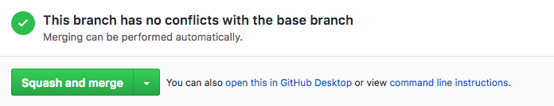

# Pull Requests #

GitHub [Pull Requests](https://help.github.com/articles/using-pull-requests) are a great way to introduce new changes to a repository through asynchronous review and discussions on top of the change you want to ship - a new feature, a typo fix or a complex production bug that is haunting your code.

Asynchronous reviews allow to spread technical knowledge: simpler ways to implement the same behavior, known issues using a certain gem, asking for help in a given subject you know someone else knows more, or even to share a code design decision.

Also, when reviewing the code, doubts will emerge, so it makes the perfect opportunity to discuss about the proper behavior your branch is introducing, about business rules involved and possible paths the application could follow.

But more than anything else, Pull Requests is a way to make developers feel connected and be aware of what's happening in different projects.

The following sections explain how to create, maintain and merge Pull Requests.

  * [Starting with branches](http://guidelines.plataformatec.com.br/pull-requests.html#starting-with-branches)
  * [Opening a Pull Request](http://guidelines.plataformatec.com.br/pull-requests.html#opening-a-pull-request)
  * [GitHub Flavored Markdown](http://guidelines.plataformatec.com.br/pull-requests.html#github-flavored-markdown)
  * [ScreenShots and GIFs](http://guidelines.plataformatec.com.br/pull-requests.html#screenshots-and-gifs)
  * [Reviewing Pull Requests](http://guidelines.plataformatec.com.br/pull-requests.html#reviewing-pull-requests)
  * [Having your Pull Request Reviewed](http://guidelines.plataformatec.com.br/pull-requests.html#having-your-pull-request-reviewed)
  * [Merging Pull Requests](http://guidelines.plataformatec.com.br/pull-requests.html#merging-pull-requests)
  * [Using hub](http://guidelines.plataformatec.com.br/pull-requests.html#using-hub)

## Pull Requesting 101 ##

#### Starting with branches ####

To kick off your Pull Request you will need a topic branch for whatever you're working on with the changes you want to introduce in a base branch. The base branch, also referred as the mainline of your repository, is the up to date/stable/deployable version of your project or application, that in most cases is the ```master``` branch of the repository (exceptions to this should always be documented and justified properly). You can also send Pull Requests to other branches in your repository, for instance when you are contributing to an existing branch of a bigger feature or an upcoming big change to your codebase. In such cases, the targeted branch will play the role of the base branch instead of ```master```.

Be sure to name your branch according to the subject of your change. We also recommend that you add your initials to your branch name as a way to identify its owner, as in ```ca-ruby20``` or ```ft-fix-all-the-things```. This pattern aims to document branch creators that have some sort of authorship of the topic branch, which is useful in projects where you have a lot of different developers working with different branches all the time (so this might not apply to Open Source projects where most people work with forks and the activity in the main repository isn't so big as a in a private repository).

#### Opening a Pull Request ####

Once you have your branch with some commits on it you can jump into the GitHub Interface and create a new Pull Request on the repository you're working on. For visual guidance, check the [GitHub Help page](https://help.github.com/articles/creating-a-pull-request) about how to create a Pull Request.

An important part of your Pull Request is the title and description that you will write for it. If your branch has only a single new commit that commit message will be used to compose the Pull Request title and description, or GitHub will suggest a humanized version of your branch name as the Pull Request title (like Lm update capybara), which isn't much helpful. In most cases you should write up something on your own to showcase what you're doing and why. You can explain the origin of a bug you're fixing, or details of the new feature that you want to introduce with your Pull Request.

#### GitHub Flavored Markdown ####

Pull Requests descriptions support the [GitHub Flavored Markdown](https://help.github.com/articles/github-flavored-markdown), so there are a lot of things that can be done to improve your Pull Request description:

You can make [references](https://help.github.com/articles/github-flavored-markdown#references) to other Issues and Pull Requests, from the same repository or another, using the ```owner/repo#number``` format. That will place a reference to your Pull Request in the mentioned Issue/Pull Request, but don't worry, it will only be visible to those who can see the repository you are working on.
[Tasks Lists](https://help.github.com/articles/github-flavored-markdown#task-lists) are a great way to breakdown tasks that are part of your Pull Requests and manage checklists before merging your changes. This can be quite handy if you open your Pull Request up front, before doing all the hard work.
You can always [mention other users and teams](https://help.github.com/articles/github-flavored-markdown#name-and-team-mentions-autocomplete) to ask for feedback or new insights, and bring people from outside the project to contribute in the current discussion.


#### ScreenShots and GIFs ####

The GitHub Flavored Markdown lets you embed images into your Pull Request description, which is extremely useful to showcase visual changes to an interface. That can be a simple padding change or a whole new feature with a GIF displaying the interface usage. Interface changes are pretty complex to understand by just reviewing the source code, and visual references will help to discuss the visual changes that are part of your Pull Request.

You can use tools like [Cloudup](https://cloudup.com/), [CloudApp](http://getcloudapp.com/), [Skitch](http://evernote.com/skitch/), [Monosnap](https://monosnap.com/welcome) and many more to host your ScreenShots and GIFs, or just drag and drop the file in the description's ```textarea``` that GitHub will take care of it for you.

To easily create GIFs of you pointing and clicking in your browser you are going to need something to record a video and convert it to a GIF image. Here are a few options that you might find useful:

* [gifify](https://gist.github.com/SlexAxton/4989674) script by Alex Sexton, based on QuickTime, ImageMagick and FFmpeg.
* [LICEcap](http://www.cockos.com/licecap/) app for Windows and Mac OS X.

#### Reviewing Pull Requests ###

"Feedback is one of the most difficult and sensitive processes in groups. It is easy to hurt people with criticism, but false compliments are also unhelpful. Compliments often make us too complacent, while criticim damages our self-esteem and can lead us to make unwise choices."

This quote is just perfect to explain the delicacy of a pull request review: not too rough, nor too loppy.

We believe that in order to write the most valuable review possible, we have to point out actionable problems.

Here are some suggestions we found out to be useful:

* Look out for [code smells](http://en.wikipedia.org/wiki/Code_smell) (From the Wikipedia definition: [code smells] indicate weaknesses in design that may be slowing down development or increasing the risk of bugs or failures in the future.) in the code that should be removed to avoid future problems with the code.
* Share, whenever possible, different solutions for a given problem through pointing code examples. The examples can come from another project or written by you just for illustration purposes.
* Don't be afraid of asking for documentation when necessary. Many times the discussions generated by a Pull Request should be added to the project in the form of documentation, even things related to specific parts of the code or the development workflow of the project. We should not let important decisions to exist only in the form of Pull Request comments, since other developers might have a hard time searching through old Pull Requests to find the reasons behind an existing implementation or design.
* If the Pull Request goals and motivations aren't clear for you, ask the Pull Request author for a better description and explanations. Remember that Pull Requests aren't only about adding code but adding business knowledge too.
* Although the commits in a Pull Request are merged together they should be meaningful on their own. Comment about better commit messages and point to [relevant documentation](http://guidelines.plataformatec.com.br/git.html) when necessary.
* Appreciate the quality of the work of your team <3.
* Try to take the most of out the GitHub UI and the [GitHub Flavored Markdown](http://guidelines.plataformatec.com.br/pull-requests.html#github-flavored-markdown) when reviewing code: for highlighting snippets, doing references between commits and other issues and calling other developers to join you in the review. Just avoid commenting on commits directly instead of the Pull Request diff, since it pollutes the Pull Request page and such comments won't be collapsed when the related lines gets changed and/or fixed by a new commit.
:shipit:
* Reviewing Pull Requests might be more important than opening your own. You should make a habit out of helping your colleagues to ship great features and quality code as they should help you to do the same. Reviewing Pull Requests isn't something that we should be doing in our spare time or when we are idle - it is part of your daily worklfow. And remember that giving your attention and time to review the work of someone else is the greatest proof that you care about his work.

Reviewing Pull Requests might be more important than opening your own. You should make a habit out of helping your colleagues to ship great features and quality code as they should help you to do the same. Reviewing Pull Requests isn't something that we should be doing in our spare time or when we are idle - it is part of your daily worklfow. And remember that giving your attention and time to review the work of someone else is the greatest proof that you care about his work.


#### Having your Pull Request Reviewed ####

Sooner or later you will issue a Pull Request. It's part of the workflow, as it was already mentioned. Everyone will be able to review your changes. Discussions will be raised, code samples will be shown, experiences will be shared. Everything is part of the review process.

When being reviewed, please consider the following bullets:

* Create a well explained Pull Request. When writing, pretend you're describing the changes to a person who is not in the context of the problem.
* Answer to questions and comments that will come.
* Don't take it personally. Nobody is doing it in order to make you feel bad or let you uncomfortable among other developers.
* Always be humble. Learn from your mistakes.
* Make sure you fully understand the other alternatives before choosing one of them or keeping the solution you've provided. If you did not fully understand why somebody asked you to change something, ask for explanations and/or examples.

#### Merging Pull Requests ####

Once everything is properly reviewed, improvements were made and the code is ready to be shipped, it is time to merge the Pull Request into the main branch. First of all, be sure that the feature branch will merge clearly into the main branch. The GitHub UI makes it dead easy to figure this out:


Pull Requests that can't be merged automatically will end up producing merge conflicts as both branches have conflicting changes into the same files. To fix this you should merge the main branch into the feature branch manually and resolve the existing conflicts.

```
  # get the latest changes from the origin repository.
  $ git checkout master
  $ git pull
  # go back to your feature branch and merge the main branch on it.
  $ git merge master
  # Deal with all the merge conflicts.
  $ git commit
```

Once you committed the merge and pushed the feature branch you can see that GitHub will be able to merge your Pull Request automatically.


Now that the merge operation will work, you can press that big green button Merge pull request and the feature branch will be merged into the main branch! After that, don't forget to delete the feature branch that won't be used anymore - you can do this right after merging your Pull Request through the GitHub interface.

#### Mirrors and smoke ####

In the case when [GitHub is a mirror](http://blog.plataformatec.com.br/2013/05/how-to-properly-mirror-a-git-repository/) of your real git repository you can't just click "Merge" and get away with this, as changes applied directly to the repository that lives on your GitHub account won't be pushed to your canonical repo.

In such cases you need to merge the branch by yourself, through the git CLI. Jump into your shell, checkout your main branch and use ```git merge``` to merge your feature branch. Don't forget to use the ```--no-ff``` flag or turn the ```merge.ff``` configuration off.

```
  $ git checkout master
  $ git merge --no-ff your-branch
  # Or turn fast forwards off for good.
  $ git config --global merge.ff false
```

The merge commit will tell GitHub to close the Pull Request that was opened to that branch, but the branch won't be deleted automatically, and you need to delete it in your canonical repository and then delete it from the GitHub repository when the changes are replicated to GitHub.

### Using hub ###

[hub](http://github.com/github/hub) is a handy tool that wraps the ```git``` command and adds some GitHub flavoured features and shortcuts. Some of them are useful for the workflow of opening and reviewing Pull Requests.

#### Checking Pull Requests locally ####

You can use a Pull Request URL to do a local checkout of someone's branch, without having to do the ```fetch``` and ```checkout``` operations manually.

```$ hub checkout https://github.com/github/hub/pull/134```

#### Opening Pull Requests from your Terminal ####

```hub pull-request``` lets you open Pull Requests directly from your Terminal through the GitHub API.

```
  $ git checkout lm-update-rails
  # Don't forget to push your branch before opening the Pull Request.
  $ git push -u remote
  # Opens a Pull Request from the 'lm-update-rails' branch from my fork repository to
  # the to the 'master' branch on the source repo.
  $ hub pull-request
```

#### Turning Issues into Pull Requests ####

You can use ```hub``` to turn a GitHub issue into a Pull Request. That can come in handy when you had first created an issue, discussed on it and now you want to open a Pull Request related to that issue.

To do that, just provide the ```-i``` flag with the issue number and that issue will become a Pull Request from your feature branch.

```
  $ git checkout lm-fixes-546
  $ hub pull-request -i 546
  # Issue 546 is now a Pull Request with the 'lm-fixes-546' branch.
```

#### Merging Pull Requests with hub ####

Similar to how ```checkout``` works, you can use ```hub merge PULL_REQUEST_URL``` to merge Pull Requests locally. This is useful in cases where you can't press the "Merge Pull Request" button in the GitHub UI (like when you are mirroring git repositories from other servers into GitHub repositories). The merge operation will be done with the ```no-ff``` option and will include the Pull Request number in the merge commit.

```
  $ hub merge https://github.com/plataformatec/devise/pull/2562
  # Merge pull request #2562 from devolute/master
  #
  # passes headers through test helpers' response
```
